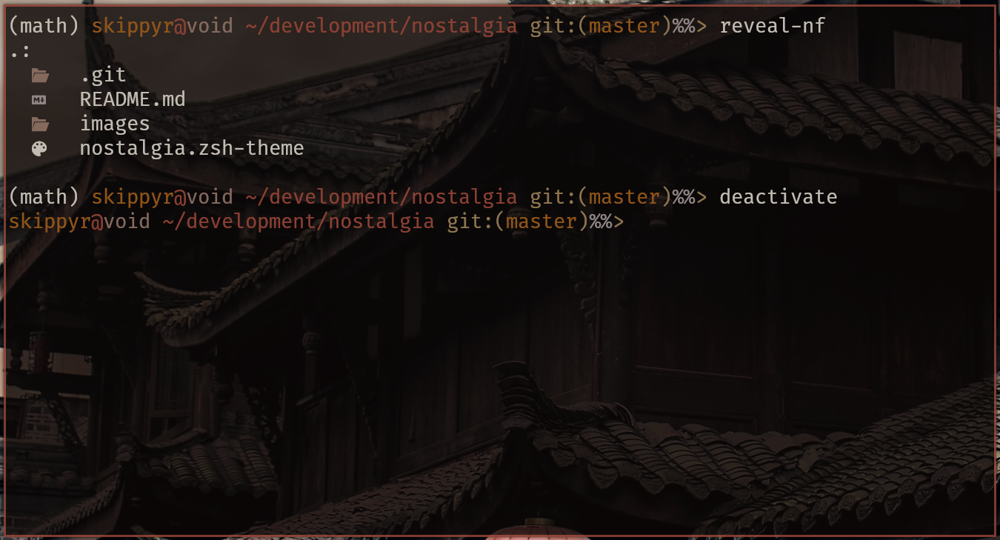

# Nostalgia

A minimalist theme for the ZSH shell that is inspired by the Windows CMD prompt.



> Colors will be different depending of your terminal emulator's theme. The
> theme used is [Flamerial](https://github.com/skippyr/flamerial).

## Features

This theme can show you the following information:

-   The exit code of failed commands.
-   Your user and hostname.
-   Your current directory path.
-   If inside a Git repository, the name of the branch.

## Installation

This theme has some dependencies that you need to download before installing it.

-   git

    This is the terminal utility used to obtain information about your Git
    repositories.

After you have installed the dependencies, you need to decide a way to install
the theme, use the one that suits you best.

### Manually

-   Run the following command to install the theme at
    `~/.local/share/zsh/themes/nostalgia`.

    ```bash
    git clone --depth=1 https://github.com/skippyr/nostalgia ~/.local/share/zsh/themes/nostalgia &&
    echo "source \"${HOME}/.local/share/zsh/themes/nostalgia/nostalgia.zsh-theme\"" >> ~/.zshrc
    ```

-   Reopen your terminal emulator.

### Within OhMyZSH

-   Install the theme in OhMyZSH custom themes' directory.

    ```bash
    git clone --depth=1 https://github.com/skippyr/nostalgia ${ZSH_CUSTOM:-${HOME}/.oh-my-zsh/custom}/themes/nostalgia
    ```

-   Change the value of the `ZSH_THEME` variable in your ZSH configuration file,
    `~/.zshrc`, to use the theme.

    ```bash
    ZSH_THEME="nostalgia/nostalgia"
    ```

-   Reopen your terminal emulator.

## Issues And Suggestions

Report issues and suggestions through the [issues tab](https://github.com/skippyr/nostalgia/issues).

## License

This project is released under the terms of the MIT license. A copy of the
license is bundled with the source code.

Copyright (c) 2023, Sherman Rofeman. MIT license.
