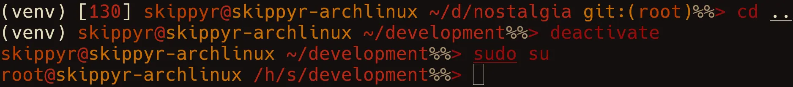

# Nostalgia
## About
A theme for the ZSH shell that is inspired by the default look of the Windows
CMD prompt.

Here is a preview that you can check out:



Note: the colors used in this shell theme depends on your terminal emulator's
      theme. This means that it may look different in your setup compared to the
      preview.

In the prompt, you will find:

- If you have sourced a virtual environment, its base name.
- If your last command failed, its exit code.
- Your user and host names.
- Your current directory path, abbreviating parent directories by their
  initials.
- If inside a Git repository, the branch name.

## Installation
### Dependencies
In order to install and run this software properly, the following dependencies
must be installed:

- `git`: required to clone this repository and obtain information about your
         Git repositories to show in the prompt.

### Procedures
Using a command-line utility, follow these steps:

- Clone this repository using `git`.

```bash
git                                                                            \
    clone --depth 1 https://github.com/skippyr/nostalgia                       \
    ~/.local/share/zsh/themes/nostalgia
```

- Add the following source rule in your `~/.zshrc` file. Ensure to not source
  any other theme to avoid causing conflicts.

```bash
source ~/.local/share/zsh/themes/nostalgia/nostalgia.zsh-theme
```

- Open a new shell session. At this point, the theme should be installed and
  running.

## Support
Report issues, questions and suggestions through its [issues page](https://github.com/skippyr/nostalgia/issues).

## Copyright
This software is under the MIT license. A copy of the license is bundled with
the source code.
