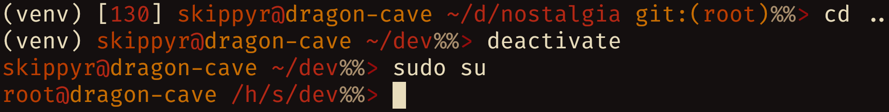

# Nostalgia
## About
A theme for the ZSH shell that is inspired by the Windows CMD prompt.


## Installation
-	Clone this repository.
```bash
git\
   clone --depth=1 https://github.com/skippyr/nostalgia\
   ~/.local/share/zsh/themes/nostalgia
```

-	Add the following source command in your `~/.zshrc` file. Ensure that you are not sourcing any other theme.
```bash
source ~/.local/share/zsh/themes/nostalgia/nostalgia.zsh-theme
```

-	Reopen ZSH.

## Copyright
Copyright (c) Sherman Rofeman. MIT license.
